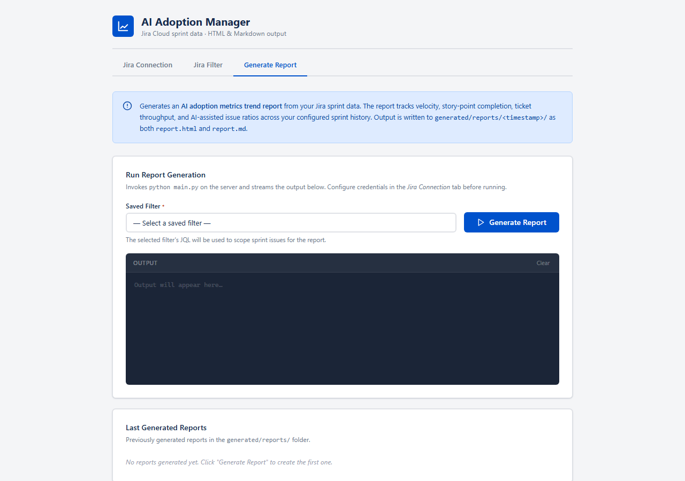
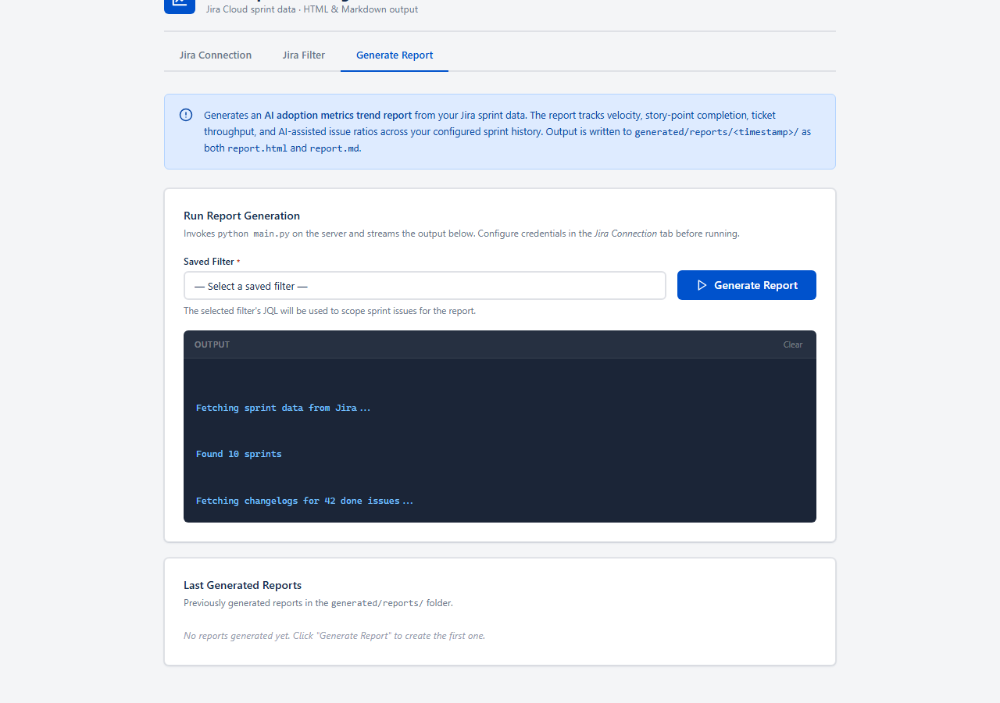
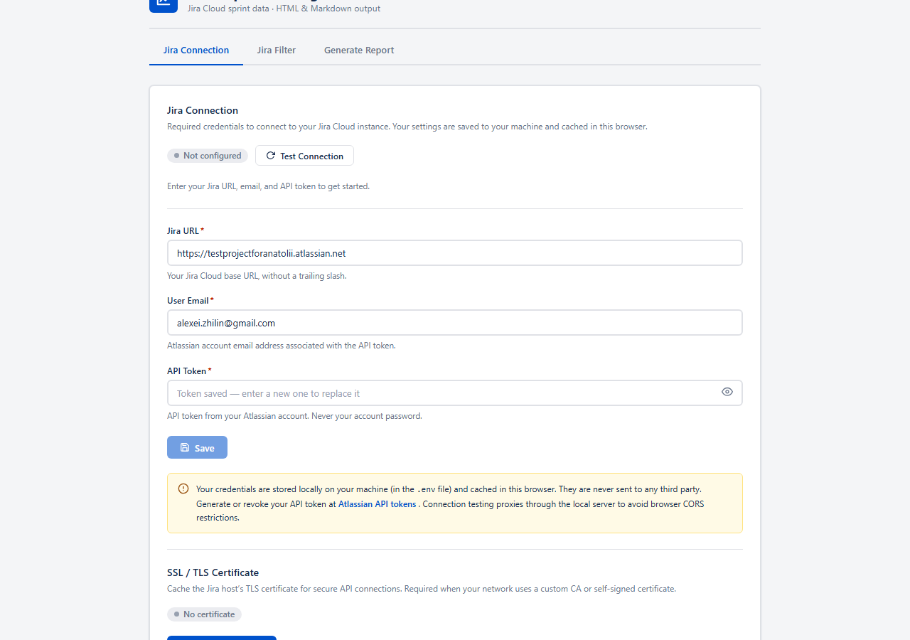
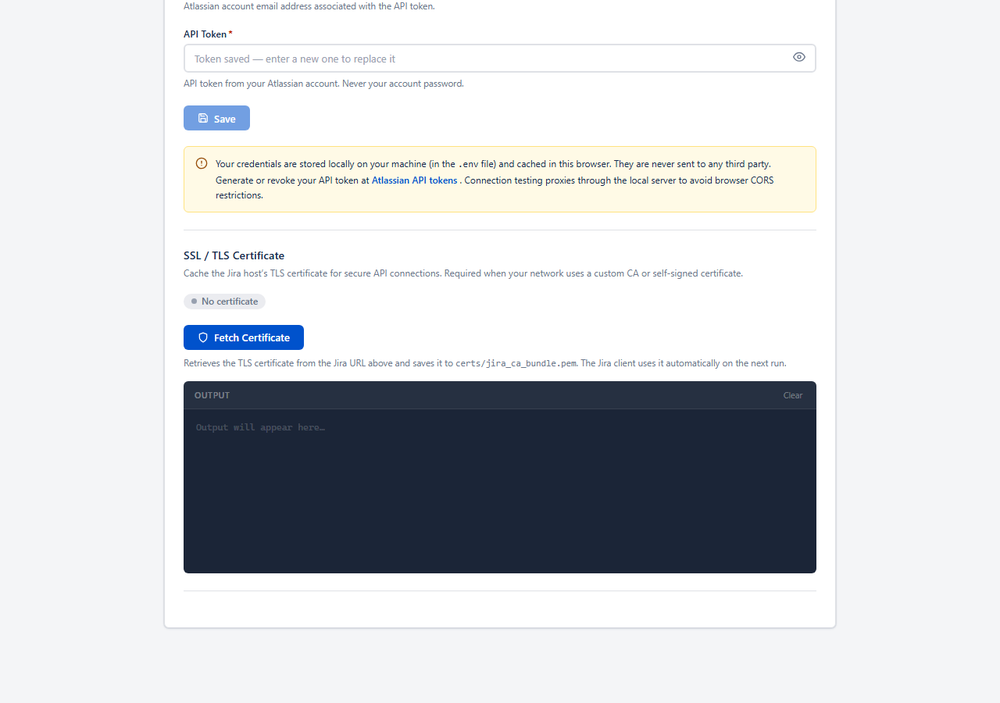
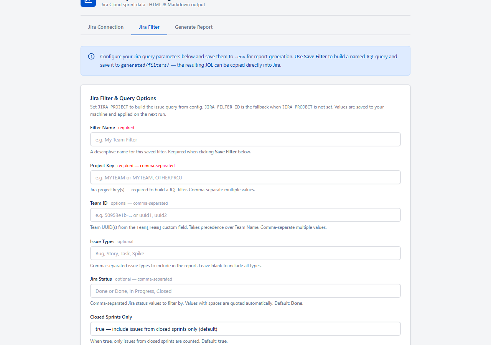

# AI Adoption Manager — Features Guide

## Overview

AI Adoption Manager is a browser-based tool that connects to your Jira Cloud account and generates sprint metrics reports. Open the app in your browser, enter your Jira credentials once, define which projects to track, and click one button to produce a ready-to-share report — all without writing any code or queries.

Reports measure velocity (story points completed per sprint) and ticket throughput over your recent sprint history. Each run saves a self-contained HTML page and a Markdown file that you can email, attach to a wiki, or open offline.

---

## Getting Started

1. Open `http://localhost:8080` in your browser after starting the app.
2. Go to the **Jira Connection** tab and enter your Jira URL, email, and API token.
3. Click **Test Connection** to verify the credentials work.
4. Click **Save** to store them for future sessions.
5. Go to the **Jira Filter** tab and define which projects and issue types to include.
6. Click **Save Filter** to name and save the filter.
7. Go to the **Generate Report** tab, choose the filter you just saved, and click **Generate Report**.

---

## Tab: Generate Report

The Generate Report tab is where you produce your metrics report. It is the first tab you see when the app opens.

### Selecting a Filter

Before generating, choose a saved filter from the **Saved Filter** drop-down. The filter tells the app which Jira projects and issue types to include. If the drop-down is empty, create a filter first in the **Jira Filter** tab.

### Report Options

Click **Report Options** to expand the configuration panel below the filter selector. These settings control what goes into the generated report.

**Project Type** — choose **Scrum** (default) or **Kanban**. This determines how the app fetches sprint data from Jira and is shown in the report header.

**Estimation Type** — choose **Story Points** (default) or **Jira Tickets**. When Story Points is selected, velocity is measured as the sum of story point values. When Jira Tickets is selected, velocity counts the number of completed issues instead.

**Metric Sections** — five checkboxes control which sections appear in the report:

| Checkbox | Section in report |
|----------|-------------------|
| Velocity Trend | Sprint-by-sprint velocity bar chart and data table |
| AI Assistance Trend | Per-sprint percentage of AI-assisted story points |
| AI Usage Details | AI tool and use-case breakdowns |
| DAU Survey | Developer Adoption & Usage survey results (days/week and % scale) |
| DAU Trend | Week-over-week DAU adoption trend combo chart (bar = avg days, line = %) |

All checkboxes default to enabled. Unchecking a section removes it from both the HTML and Markdown outputs. At least one section must be enabled — the Generate button is disabled when all are unchecked.

All Report Options selections are saved to your browser's localStorage and restored automatically on the next visit.

### Generating a Report

Click the **Generate Report** button to start. The app connects to Jira, pulls sprint and issue data, computes the metrics, and writes the report files. Progress messages stream in real time in the **Output** panel below the button so you can follow along.

The run typically completes in under a minute, depending on the number of sprints and issues. When it finishes, a success message appears and the new report is added to the **Last Generated Reports** list at the bottom of the tab.

### Viewing Past Reports

The **Last Generated Reports** section at the bottom of the tab lists every report you have produced, sorted newest first. Each entry shows the timestamp and provides a direct link to open the HTML report in your browser.

Reports are saved locally in the `generated/reports/` folder. They remain available between sessions and can be shared as standalone HTML files.

---

## Tab: Jira Connection

The Jira Connection tab is where you enter and manage the credentials the app uses to talk to your Jira Cloud instance. You only need to do this once — the settings are saved on your machine and remembered the next time you open the app.

### Entering Credentials

Fill in three fields:

- **Jira URL** — the base address of your Jira Cloud site, for example `https://yourcompany.atlassian.net`. No trailing slash.
- **User Email** — the email address associated with your Atlassian account.
- **API Token** — a personal access token from your Atlassian account settings. This is not your Atlassian password.

A link to the Atlassian API tokens page is shown beneath the API Token field for convenience.

### Testing the Connection

Click **Test Connection** to send a quick request to Jira using the credentials you have entered. A status badge next to the button shows the result — green for a successful connection, red if something is wrong. Check that your URL is correct and your token is valid if the test fails.

### Saving Credentials

Click **Save** to write the credentials to the `.env` file on your machine and cache them in the browser. The next time you open the app, the fields will be pre-filled and no re-entry is needed. Your credentials are stored locally and never transmitted anywhere other than directly to Jira.

### SSL / TLS Certificate

If your Jira instance uses a custom or self-signed TLS certificate that your system does not already trust, the app may fail to connect. The **SSL / TLS Certificate** section at the bottom of this tab lets you resolve that.

Click **Fetch Certificate** to download and cache the certificate from your Jira URL. The app uses the cached certificate automatically on subsequent runs. The status badge next to the section header shows whether a certificate is currently saved.

---

## Tab: Jira Filter

The Jira Filter tab lets you define exactly which issues are included in your reports. A filter is a named set of query parameters — once saved, it appears in the **Saved Filter** drop-down on the Generate Report tab.

### Building a Filter

Fill in the fields to scope your report:

| Field | Required | Description |
|-------|----------|-------------|
| **Filter Name** | Yes | A label for this filter, e.g. "My Team" or "Backend Q1". |
| **Project Key** | Yes | One or more Jira project keys, comma-separated (e.g. `MYTEAM` or `MYTEAM, OPS`). |
| **Team ID** | Optional | One or more Team UUIDs from the Team custom field. Takes precedence over project key when provided. |
| **Issue Types** | Optional | Comma-separated list of issue types to include (e.g. `Bug, Story, Task`). Leave blank to include all types. |
| **Jira Status** | Optional | Comma-separated status values to count as completed (default: `Done`). |
| **Closed Sprints Only** | Optional | When enabled (the default), only issues from closed sprints are counted. |

### Saving a Filter

Once the fields are filled in, click **Save Filter**. The app validates the required fields, builds the corresponding JQL query, and saves it as a named `.env` file in the `generated/filters/` folder. A confirmation message appears in the output panel, and the new filter becomes immediately available in the Generate Report tab.

### Managing Saved Filters

The **Last Created Filters** section at the bottom of the tab lists all previously saved filters. Each entry shows the filter name and creation time. You can click a saved filter to reload its settings into the form and edit or re-save it.

---

## Tips & Shortcuts

- **Credentials persist** — after saving once, the Jira Connection form pre-fills on every subsequent visit. You do not need to re-enter your credentials.
- **Multiple filters** — save a separate filter for each team or project and switch between them on the Generate Report tab without changing any other settings.
- **Offline reports** — generated HTML reports are self-contained and can be opened without the app running or a Jira connection.
- **Clear the log** — a **Clear** button at the top-right of every output panel removes previous messages so you can focus on the current run.
- **Re-run anytime** — clicking **Generate Report** again always creates a new timestamped report without overwriting previous ones.
