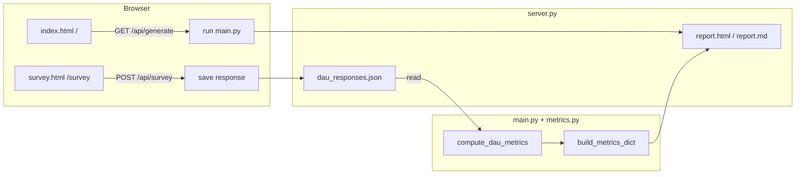

# DAU Survey and Metric Plan

## Overview

Add a self-hosted DAU survey that team members fill in locally, stores responses in a JSON file, computes a DAU metric (average AI-tool usage days/week per person), and surfaces the results in both the HTML and Markdown reports.

## Architecture

> **Note (2026-03-27):** The original architecture below describes a server-side `POST /api/survey`
> route. This approach was superseded in favour of **client-side-only submission**: the survey page
> saves responses directly to the local filesystem via the File System Access API (with a browser
> download fallback). No server endpoint is created. The `dau_responses.json` filename shown in the
> diagram is also superseded; response files now follow the `dau_<username>_<timestamp>.json` naming
> convention and are stored in `generated/` by default. See
> [`dau_survey_requirements.md`](../requirements/dau_survey_requirements.md) for the current spec.

## Survey Questions

**Question 1** — What is your primary role on the project?
- Developer
- QA / Test Engineer
- Business Analyst
- Delivery Manager / Lead
- Other

**Question 2** — How many working days during the past week did you use AI tools (e.g. GitHub Copilot, Gemini Assist) as part of your work?
- Every day (5 days)
- Most days (3–4 days)
- Rarely (1–2 days)
- Not used

## DAU Scoring

| Answer | Days/week score |
|--------|----------------|
| Every day (5 days) | 5 |
| Most days (3–4 days) | 3.5 |
| Rarely (1–2 days) | 1.5 |
| Not used | 0 |

Team DAU average = sum of scores / number of respondents.

## Files to Create

- **`survey.html`** — Standalone survey page with the 2 questions. On submit, POSTs JSON to `/api/survey` and shows a confirmation. Styling matches the existing report aesthetic.

## Files to Modify

- **`server.py`**
  - `do_GET`: add `/survey` route → serve `survey.html`
  - `do_POST`: add `/api/survey` route → `_handle_submit_survey()`
  - New `_handle_submit_survey()`: reads JSON body, appends `{role, usage, timestamp}` record to `dau_responses.json`

- **`metrics.py`**
  - Add `compute_dau_metrics(responses_path)` — reads `dau_responses.json`, maps answers to scores, returns `{team_avg, response_count, by_role: [{role, avg, count}], breakdown: [{answer, count}]}`
  - Update `build_metrics_dict()` to call `compute_dau_metrics()` and include `"dau"` key

- **`templates/report.html.j2`**
  - Add a new `<section>` for DAU below cycle time
  - Shows team average, response count, per-role table, and a horizontal bar chart (Chart.js) for the usage-frequency breakdown

- **`report_md.py`**
  - Add a `## Daily Active Usage (DAU)` section with a summary table and per-role breakdown

- **`.gitignore`**
  - Add `dau_responses.json` so survey data stays local and out of version control
